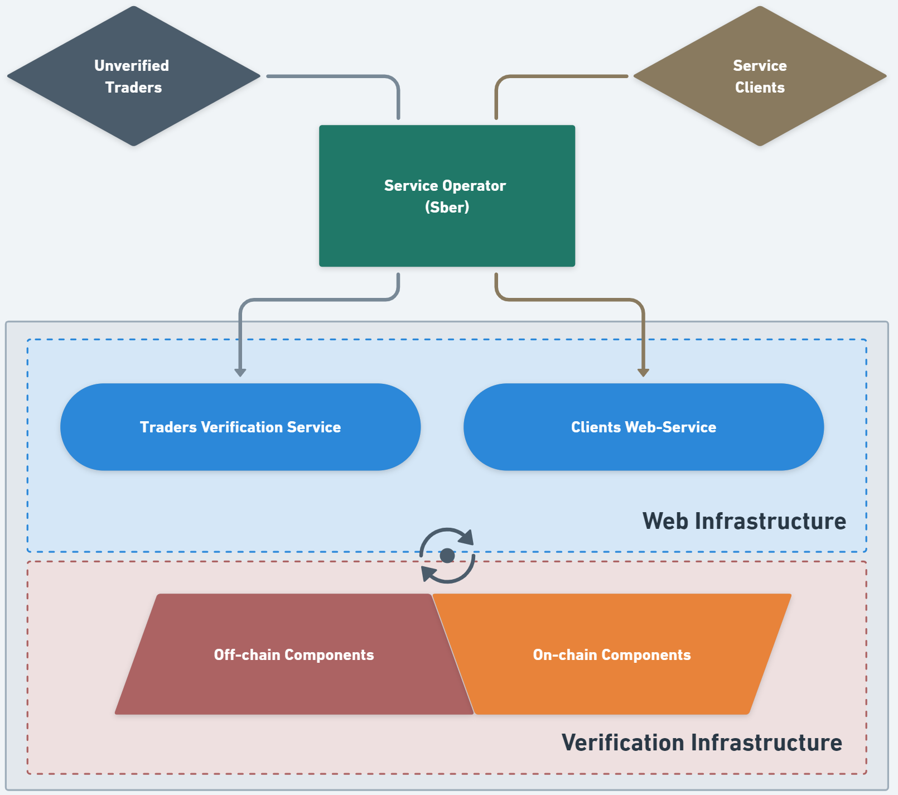

# "Solution name"

## Team: Fraternitas<>Libertatis

## 1. General Overview

- Demo video - [Link]
- Source code - [Link](https://github.com/Nurnberg-Meistersinger/sber-hackaton-2024)
- Presentation - [Link]
- Built for Sber Hackaton 2024 - [Link](https://www.sberbank.com/ru/person/forms/hackathon)

Согласно [данным CoinMarketCap](https://coinmarketcap.com/currencies/volume/24-hour/), на `19.04.2024` суммарный суточный объём торгов по криптовалютам `BTC` и `ETH` составил более `$60b`. Это означает, что рынок криптотрейдинга сегодня является одним из крупнейших во всей индустрии Web3.

Рынок криптотрейдинга сегодня переполнен трейдерами-одиночками и небольшими трейдинговыми командами, предлагающими свои консалтинговые услуги, доходные стратегии и инвестиционные продукты, основанные на купле-продаже криптоактивов, которые обещают своим инвесторам высокую доходность. Эти трейдеры совершают арбитражные сделки с использованием кастомынх MEV-ботов, LP-токенов, flashloans и многих других стратегий, которые не позволяют достоверно отслеживать историю сделок. Из-за этого невозможно проверить, действительно ли приносят доход инвестиционные продукты этих трейдеров, и можно ли доверять их опыту трейдинга.

Прототип созданного нами сервиса позволяет очистить весь рынок от мошенников и недобросовестных трейдеров. Он позволяет аггрегировать, а затем со 100%-ной вероятностью верифицировать подлинность сделок и историческую доходность этих трейдеров.

### What it is?

Для того чтобы доказать свою компетентность, трейдер должен доказать умение сохранять положительную доходность в среднесрочной и долгосрочной перспективе. Таким образом, в процессе верификации результатов трейдеров наш сервис опирается на единственный надёжный показатель - **historical performance**. Для того чтобы полученные результаты верификации нельзя было трактовать двояко или сфальсифицировать, наш сервис использует trustless механизм, основанный на криптографии Zero-Knowledge. Такой подход позволяет трейдерам с математически 100%-ной вероятностью доказать достоверность своих сделок посредством генерации **Zero-Knowledge Proof**, а любому пользователю - независимо **верифицировать этот Proof**.

### How it works?

**В сервисе есть 3 основных актора:**

1. `Unverified Traders` - это third-party individuals, entities or institutions, которые хотят продавать клиентам сервиса доступ к своим консалтинговым услугам или торговым сигналам для осуществления копитрейдинга.

2. `Service Operator (Sber)` - это организация, которая осуществляет регуляторные функции по отношению к трейдерам, взимает комиссии с пользователей и непосредственно управляет работой сервиса.

3. `Service Clients` - это покупатели услуг трейдеров, которые сами выбирают себе поставщика сигналов и после оплаты получают возможность повторять сделки выбранных трейдеров для получения доходности.

**На схеме ниже вы можете видеть high-level overview всей архитектуры сервиса:**

## 2. Technical Overview

## 3. Future Track

## 4. Deployment Addresses and TXs

### Sepolia Testnet

### Siberium Testnet

## 5. Installation & Usage

### Installation

### Compiling

### Testing

### Deployment (Sepolia Testnet)

### Deployment (Siberium Testnet)
