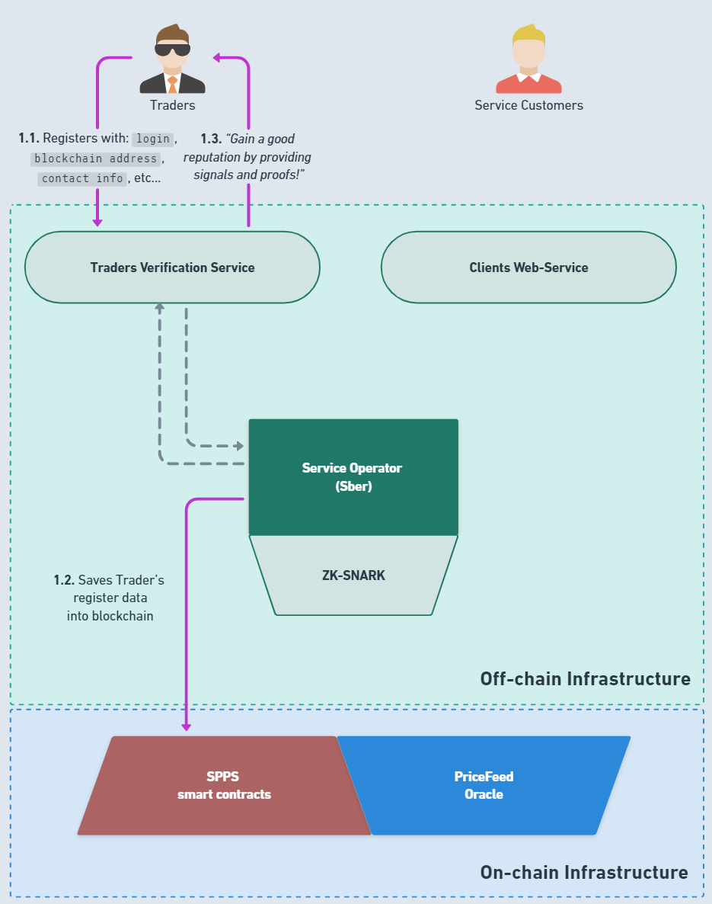
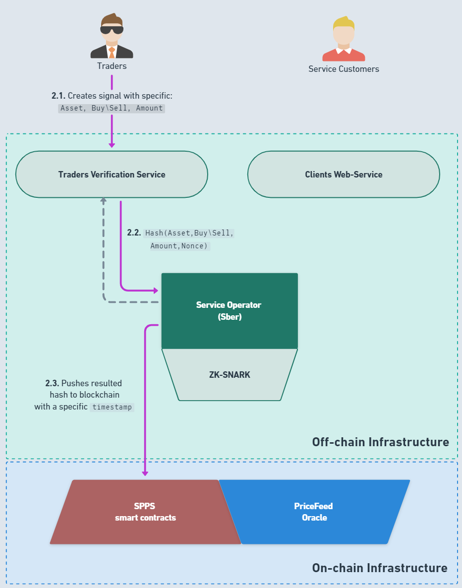
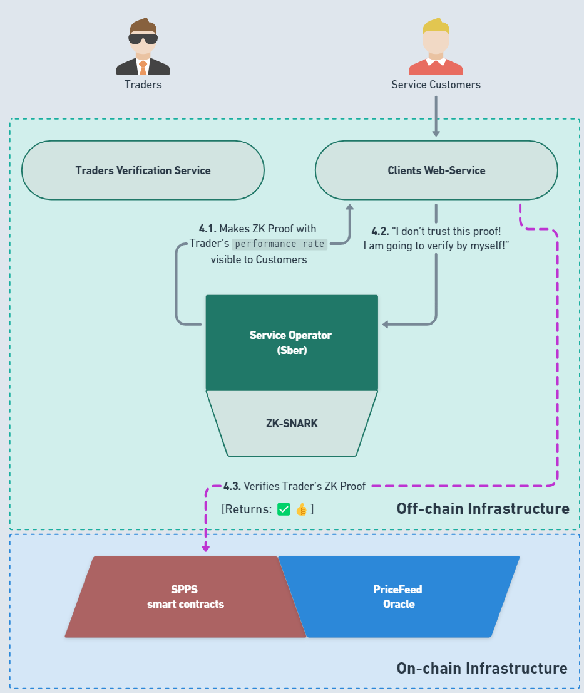
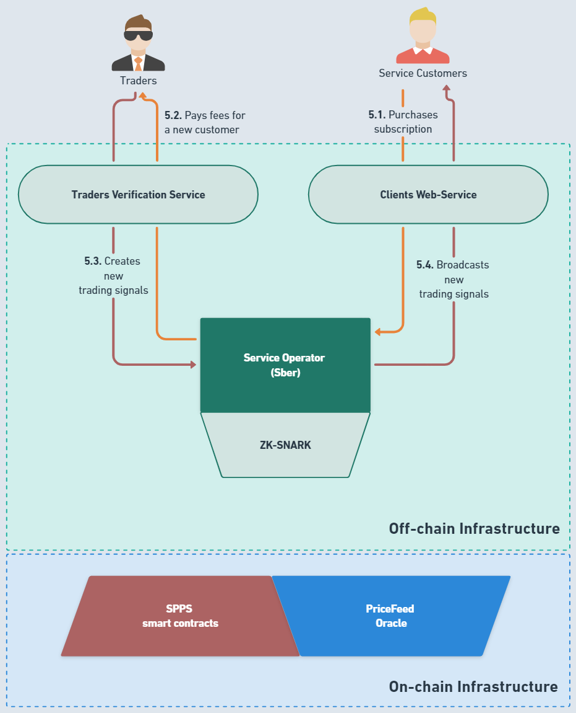
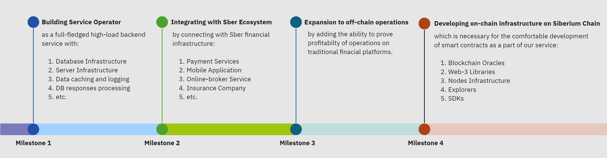

# Sber Profitability Proving Service

## Team: "Protectorium". Built for [Sber Hackaton 2024](https://www.sberbank.com/ru/person/forms/hackathon).

## 1. General Overview

- Explore [[Presentation](https://www.canva.com/design/DAGGJiscxBQ/ay7GFpa1CL_YGy7lf4ACIw/edit?utm_content=DAGGJiscxBQ&utm_campaign=designshare&utm_medium=link2&utm_source=sharebutton)] to explore the main features.
- Watch [[Demo Video](https://www.youtube.com/watch?v=sADnCVqyH24)] to explore workflow of the service.
- Try [[Solution Prototype](https://nurnberg-meistersinger.github.io/sber-hackaton-2024/)] to test available features and mechanics.

According to [CoinMarketCap data](https://coinmarketcap.com/currencies/volume/24-hour/), as of `04/19/2024`, the total daily trading volume for the cryptocurrencies `BTC` and `ETH` amounted to more than `$60b`. This means that the crypto trading market today is one of the largest in the entire Web3 industry.

The crypto trading market today is crowded with single traders and small trading teams offering their consulting services, income strategies and investment products based on the purchase and sale of crypto assets that promise their investors high returns. These traders make arbitrage trades using custom MEV bots, LP tokens, flashloans and many other strategies that do not allow reliable tracking of trade history. Because of this, it is impossible to verify whether the investment products of these traders are truly profitable and whether their trading experience can be trusted.

The prototype of the service we created **allows to clear the entire market of scammers and unscrupulous traders**. The proposed solution allows to aggregate and then verify with 100% probability the authenticity of transactions and the historical profitability of these traders.

The ranking system is designed so that the best traders attract more attention from service clients, increasing their passive income, which encourages them to timely publish Zero-Knowledge Proofs of the profitability of their transactions and forecasts.

### What it is?

To prove competence, a trader must demonstrate the ability to maintain positive returns over the medium to long term. Thus, in the process of verifying traders’ results, our service relies on the only reliable indicator - **historical performance**. To ensure that the verification results cannot be interpreted in two ways or falsified, our service uses a trustless mechanism based on Zero-Knowledge cryptography. This approach allows traders to prove the authenticity of their transactions with a mathematical 100% probability by generating **Zero-Knowledge Proof**, and any user to independently **verify this Proof**.

### How it works?

**The service has 3 main actors:**

1. `Traders` are unverified third-party individuals, entities or institutions that want to sell clients of the service access to their consulting services or trading signals for copy trading. They upload their signals into the system, which are then aggregated and verified using backend ZK-SNARK proving system.

2. `Service Operator (Sber)` is an organization that carries out regulatory functions in relation to traders, charges commissions from users and directly manages the operation of the service (for example, sets a `time interval` for which traders must provide evidence: monthly, yearly etc). Also, the operator checks `Traders` according to criteria that cannot be verified using On-chain and Off-chain Components.

3. `Service Clients` are buyers of traders' services who choose their own signal provider and, after payment, get the option to repeat transactions and trading strategies of the selected traders to obtain profitability.

**In the diagram below you can see a high-level overview of the entire service architecture:**

## 2. Technical Overview

**The general flow of the system looks like this:**

1. Traders register on the platform with their login, blockchain address and contact information.

2. Trader creates several trading signals via **Traders Verification Service**, which sends the request into **blockchain** using the following template: `hash(asset, buy/sell, amount, nonce)`. Trade data (ticker, amount, trade direction) is inserted by Trader himself, all this data is concatenated and hashed. Resulting hash is stored on the blockchain with an associated timestamp.

3. **Service Operator** sequentially aggregates all signals created by a specific Trader. Once all necessary signals for a specific time interval are accounted, **Service Operator** executes ZK Proof generation in the backend **ZK-SNARK** proving system. ZK-SNARK protocol is used for proving that the trader knows preimages of signals’ hashes that correspond to the declared `performance rate`. After ZK Proof is generated, it is published by **Service Operator** into **SPPS smart contract**, so everyone could independently double check it.

4. **ZK-SNARK** returns the resulting ZK Proof to **Traders Verification Service**, which makes the received proof visible for clients in **Client Web-Service**. In case if **Client** doesn't trust a visible proof, he can verify its correctness by himself - he just needs to make a request into blockchain, which will return the evidence that proof has been successfully verified.

5. Finally, **Service Customers** can confidently purchase a subscription to new signals of profitable **Traders** to earn passive income!

> _Such an architecture ensures that external observers don't understand which signals a Trader has made - it is private. What is more, all market data needed for performance calculation is taken from on-chain price oracle. So all signals’ data are stored on a chain and reliable cryptography is used for performance proving - it is trustless._

## 3. Technological Stack

- **Frontend** is currently implemented as Angular-based SPA, which inludes `Traders Verification Service` and `Clients Web-Service` and uses `web3-eth-contract`, `wasmsnark` libraries and `@metamask/providers` SDK.

- **Off-chain Infrastructure** is partly implemented as a `Service Opertor` backend service, which generates ZK-Proofs using `ZK-SNARK` ciruits, written in **Circom**. We also decided to use **Groth16** as a main proving system for our circuits.

- **On-chain Infrastructure** consists of two main parts: On-chain smart contracts written in **Solidity** and any trusted PriceFeed Oracle. In this MVP, we considered using **Chainlink PriceFeed Oracle** as the main price data provider.

## 4. Future Track

> _Since our prototype implements only the simplest functionality, but at the same time has the potential to become a full-fledged service in the Sber Ecosystem, in this section we will outline the main directions for the further development of our solution._

1. **Building `Service Operator` as a full-fledged high-load backend service**, which will have it's own Database Infrastructure and Server Infrastructure. Additionally, current Proof-of-Concept requires from Service Operator to maintain its own Data caching and logging Methodology, as soon as DB responses processing Methodology.

2. **Integrating the service with Sber Ecosystem** by connecting SPPS with the financial infrastructure of Sber: payment services, mobile application, online-broker service, insurance company, etc. We predict great interest from both bank clients and subsidiary services of the ecosystem, since our service allows to offer a qualitatively new product that has no competitors and alternatives.

3. **Expansion to off-chain operations** - by expanding the functionality of the service: introducing the ability to confirm profitability not only for on-chain, but also off-chain operations. This will significantly reduce the financial barrier to entry for small suppliers of investment products and turn the service into an aggregator-intermediary between clients and small, uncoordinated investment companies.

4. **Developing on-chain infrastructure for Siberium Chain**, which is necessary for the comfortable development of `On-chain Infrastructure` of our service: Blockchain Oracles, Web-3 Libraries, Nodes Infrastructure, Explorers, SDKs.

## 5. Deployment Addresses and TXs

### Sepolia Testnet

- **Sepolia Testnet Explorer** - [Link](https://sepolia.etherscan.io/address/0x6b8930a83aa58E0893206088c56E04deb983879E)

- **Contract Address** - 0x6b8930a83aa58E0893206088c56E04deb983879E

### Siberium Testnet

- **Siberium Testnet Explorer** - [Link](https://explorer.test.siberium.net/address/0xbb8c8E79c34C6420716A6937bF7E3B9226Cc81f5)

- **Contract Address** - 0xbb8c8E79c34C6420716A6937bF7E3B9226Cc81f5

## 6. MVP Usage 

- **UI sandbox** - https://nurnberg-meistersinger.github.io/sber-hackaton-2024/
